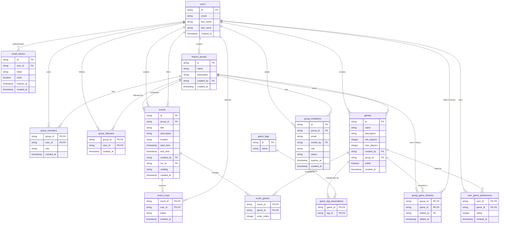

# Improv App

A web application for organizing and managing improv activities, built with Go and modern web technologies.

## Features

- User authentication and authorization
- Dynamic page routing
- Template-based UI
- PostgreSQL database
- Hot-reloading development environment with Air

## Prerequisites

- Go 1.16 or higher
- PostgreSQL
- Docker and Docker Compose (optional, for containerized development)

## Project Structure

```
improv-app/
├── main.go           # Main application entry point
├── database.go       # Database connection and operations
├── templates/        # HTML templates
├── schema.sql        # Database schema
├── .air.toml         # Air configuration for hot-reloading
├── docker-compose.yml # Docker configuration
└── .env              # Environment variables
```

## Getting Started

1. Clone the repository:
   ```bash
   git clone [repository-url]
   cd improv-app
   ```

2. Set up environment variables:
   ```bash
   cp .env.example .env
   # Edit .env with your configuration
   ```

3. Install dependencies:
   ```bash
   go mod download
   ```

4. Set up the database:
   ```bash
   # Using Docker
   docker-compose up -d

   # Or manually create a PostgreSQL database and run:
   psql -d your_database_name -f schema.sql
   ```

5. Start the development server:
   ```bash
   # Install Air if you haven't already
   go install github.com/cosmtrek/air@latest

   # Start the server with hot-reloading
   air
   ```

The application will be available at `http://localhost:4080`.

## Development

This project uses [Air](https://github.com/cosmtrek/air) for hot-reloading during development. Air will automatically rebuild and restart the application when you make changes to your Go files.

### Key Components

- **Templates**: HTML templates are stored in the `templates/` directory and are automatically loaded at startup.
- **Database**: PostgreSQL is used for data storage. The schema is defined in `schema.sql`.
- **Routing**: The application uses Gorilla Mux for routing and supports dynamic page loading.

## Planned Features

### Improv Groups
- Create and manage improv troupes or practice groups
- Group membership with different roles (admin, member)
- Group description and details

### Events
- Schedule improv events for specific improv groups (all events must belong to a group)
- Event location management
- RSVP system for tracking attendance
- Ability to organize games for each event

### Game Catalog
- Comprehensive database of improv games
- Game details including description, minimum and maximum players
- Tagging system for categorizing games (e.g., warmup, short-form, long-form)
- User rating system for games

### Game Planning
- Assign games to specific events
- Order games within an event
- Track user preferences for game selection
- Filter games by tags, player count, or popularity
- MCs can manage games for their events, selecting them from the group library

## Database Schema


